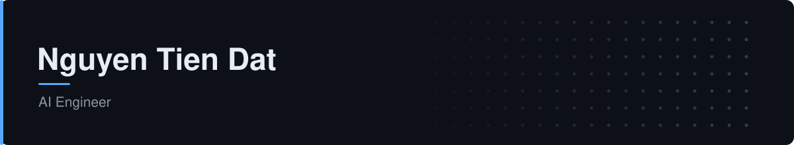

<picture>
  <source media="(prefers-color-scheme: dark)" srcset="header-dark.svg">
  <source media="(prefers-color-scheme: light)" srcset="header-light.svg">
  
</picture>

  
  
  

## About Me

- AI Engineer working on multi-agent platforms and RAG systems.
- Currently building an AI assistant for a B2B CRM, on LangGraph and Deep Agents.
- First author of a Springer CCIS 2026 paper on reducing hallucination in RAG.
- Mostly interested in the part around the model: approval flows, evaluation, and retrieval you can trust.

## Skill stack

<a href="https://skillicons.dev">
  <picture>
    <source media="(prefers-color-scheme: dark)" srcset="https://skillicons.dev/icons?i=python,typescript,fastapi,postgresql,redis,docker,git,githubactions,linux&theme=dark">
    
  </picture>
</a>

**Also comfortable with**: LangGraph, LangChain Deep Agents, Qdrant, Pydantic, SQLAlchemy, Keycloak, SQL.

## Featured Work

<table>
  <tr>
    <td align="center" width="50%">
      
       
      <b>Agentic Workflow for Reliable RAG</b> 
      An iterative multi-agent loop that extracts claims, verifies them against retrieved evidence, and reformulates the query. 
      &#128279; <a href="https://doi.org/10.1007/978-3-032-21625-0_8">Paper</a> &#183; <a href="https://github.com/nqtiendat/agentic-workflow-reliable-reasoning">Repo</a>
       
      Springer CCIS 2026 &#183; first author
    </td>
    <td align="center" width="50%">
      
       
      <b>Agent Harness Framework</b> 
      A lightweight harness for orchestrating and grading multi-agent workflows, with policy gates and evaluation pipelines. 
      &#128279; <a href="https://github.com/nqtiendat/harness-agent-framework">Repo</a>
       
      Tags: Agents, Evaluation, Python
    </td>
  </tr>
</table>

## Stats

<table>
  <tr>
    <td valign="top">
      <picture>
        <source media="(prefers-color-scheme: dark)" srcset="https://github-profile-summary-cards.vercel.app/api/cards/profile-details?username=nqtiendat&theme=github_dark">
        
      </picture>
    </td>
    <td valign="top">
      <picture>
        <source media="(prefers-color-scheme: dark)" srcset="https://github-profile-summary-cards.vercel.app/api/cards/repos-per-language?username=nqtiendat&theme=github_dark">
        
      </picture>
    </td>
  </tr>
</table>

## Recent Activity

<!-- ACTIVITY:START -->
<ul>
  <li><a href="https://github.com/nqtiendat/demo-cicd">demo-cicd</a> 2026-07-20</li>
  <li><a href="https://github.com/nqtiendat/agentic-workflow-reliable-reasoning">agentic-workflow-reliable-reasoning</a> — Official LangChain implementation for the Springer CCIS paper "Agentic Workflow for Reliable RAG: Reducing Hallucinations with Coordinated Reasoning". Features an iterative multi-agent coordination loop (FVFL) for automated claim extraction, fact-verification, and query reformulation using local LLMs. 2026-06-01</li>
  <li><a href="https://github.com/nqtiendat/harness-agent-framework">harness-agent-framework</a> — A lightweight Agent Harness Framework designed for orchestrating and evaluating LLM-based multi-agent workflows. Provides server-enforced discipline, deterministic policy gates, quality check layers, and evaluation pipelines to ensure auditable, reliable, and safe agentic execution. 2026-05-26</li>
  <li><a href="https://github.com/nqtiendat/harness-template-experimental">harness-template-experimental</a> 2026-05-25</li>
</ul>
<!-- ACTIVITY:END -->

<a href="https://github.com/nqtiendat?tab=repositories">&#10145;&#65039; All repositories</a>

