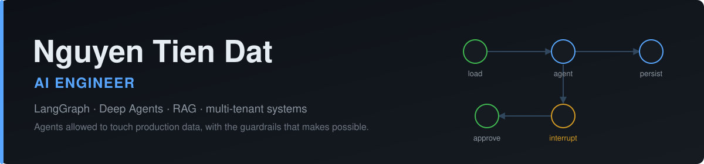

  
  
  

<h2>What I'm Building</h2>

AI Engineer at FPT Digital, working on **Sales Intelligence** — an AI assistant inside a
multi-tenant B2B CRM. A LangGraph `StateGraph` with a Deep Agents loop compiled in as a
subgraph, checkpointed to PostgreSQL and streamed to the UI over SSE. Every CRM write pauses
on an `interrupt`, shows the salesperson the record's old and new values, and resumes from
the checkpoint once approved — idempotency keys make sure an approved write never lands twice.

Graded on 36 multi-turn scenarios x 3 runs against answers pulled from PostgreSQL:
**91% pass, $0.015 and 14s median per question.**

<h2>Featured Work</h2>

<table>
<tr>
<td width="50%" valign="top">

**[Agentic Workflow for Reliable RAG](https://doi.org/10.1007/978-3-032-21625-0_8)** 
*Springer CCIS 2026 — first author*

An iterative multi-agent loop (FVFL) that extracts claims, verifies them against retrieved
evidence, and reformulates the query until the answer holds up. Cuts hallucination in RAG.

[Implementation &rarr;](https://github.com/nqtiendat/agentic-workflow-reliable-reasoning)

</td>
<td width="50%" valign="top">

**[Agent Harness Framework](https://github.com/nqtiendat/harness-agent-framework)** 
*Python*

A lightweight harness for orchestrating and grading LLM multi-agent workflows:
server-enforced discipline, deterministic policy gates, quality-check layers,
and evaluation pipelines.

[Repository &rarr;](https://github.com/nqtiendat/harness-agent-framework)

</td>
</tr>
</table>

<h2>Recent Activity</h2>

<!-- ACTIVITY:START -->
<ul>
  <li><a href="https://github.com/nqtiendat/nqtiendat">nqtiendat</a> — Profile README 2026-09-21</li>
  <li><a href="https://github.com/nqtiendat/demo-cicd">demo-cicd</a> 2026-07-20</li>
  <li><a href="https://github.com/nqtiendat/agentic-workflow-reliable-reasoning">agentic-workflow-reliable-reasoning</a> — Official LangChain implementation for the Springer CCIS paper "Agentic Workflow for Reliable RAG: Reducing Hallucinations with Coordinated Reasoning". Features an iterative multi-agent coordination loop (FVFL) for automated claim extraction, fact-verification, and query reformulation using local LLMs. 2026-06-01</li>
  <li><a href="https://github.com/nqtiendat/harness-agent-framework">harness-agent-framework</a> — A lightweight Agent Harness Framework designed for orchestrating and evaluating LLM-based multi-agent workflows. Provides server-enforced discipline, deterministic policy gates, quality check layers, and evaluation pipelines to ensure auditable, reliable, and safe agentic execution. 2026-05-26</li>
  <li><a href="https://github.com/nqtiendat/harness-template-experimental">harness-template-experimental</a> 2026-05-25</li>
</ul>
<!-- ACTIVITY:END -->

<a href="https://github.com/nqtiendat?tab=repositories">&#10145;&#65039; All repositories</a>

<h2>Stack</h2>

Python &#183; TypeScript &#183; SQL &#183; LangGraph &#183; LangChain Deep Agents &#183; FastAPI &#183; Pydantic &#183;
SQLAlchemy &#183; PostgreSQL (RLS) &#183; Qdrant &#183; Redis &#183; Docker &#183; Keycloak

<h2>GitHub Stats</h2>

  Previously: AI Engineer at Mitek — agentic RAG customer-service chatbot, answer accuracy
  78% &rarr; 88% while cutting cloud API cost ~40%, retrieval under 400ms, 60-100 concurrent
  requests at p50 under 3s.

&#128235; <a href="mailto:tiendattp91@gmail.com">tiendattp91@gmail.com</a>

